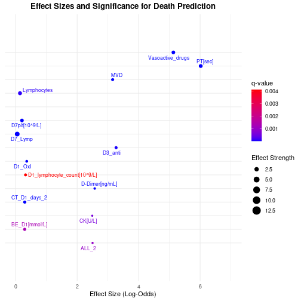

```r
library(purrr)
library(broom)
library(ggrepel)
```

# Load Data


```r
data <- read_tsv(file = "../data/03_data_augmented.tsv")
```

```
## Rows: 316 Columns: 125
## ── Column specification ───────────────────────────────────────────────────────────────────────────────────────────────────────────
## Delimiter: "\t"
## chr (35): Age_range, Fever_days, Imaging_Improvement>25%_(after_1_week), IL-6[pg/mL], Oxygenation_index_D1[mmHg], Lactic_acid_D...
## dbl (90): Number, Age_mean, Age_over_65(1,YES;_2,_NO), Charlson_index[score], Disease_onset_D1_highest_body_temperature[℃], D3_...
## 
## ℹ Use `spec()` to retrieve the full column specification for this data.
## ℹ Specify the column types or set `show_col_types = FALSE` to quiet this message.
```

## PCA

### Select numeric columns and normalize

#### Drop NAs (Pass to 02_clean)


```r
data_NA_proportion <- NA_prop(data)

columns_todrop <- data_NA_proportion |> 
  filter(na_proportion > 0.1) |> 
  pull(column)

pca_data <- data |> 
  select(-columns_todrop)
```

```
## Warning: Using an external vector in selections was deprecated in tidyselect 1.1.0.
## ℹ Please use `all_of()` or `any_of()` instead.
##   # Was:
##   data %>% select(columns_todrop)
## 
##   # Now:
##   data %>% select(all_of(columns_todrop))
## 
## See <https://tidyselect.r-lib.org/reference/faq-external-vector.html>.
## This warning is displayed once every 8 hours.
## Call `lifecycle::last_lifecycle_warnings()` to see where this warning was generated.
```

### Transform columns to numeric


```r
pca_data <- pca_data |> 
  select(-Number, -Age_over_65, -Age_range, -ECMO) |> 
  mutate(across(where(is.character), ~ as.numeric(.)))
```

```
## Error in `select()`:
## ! Can't subset columns that don't exist.
## ✖ Column `Age_over_65` doesn't exist.
```

```r
numeric_scaled_data <- pca_data |> 
  select(where(is.numeric)) |> 
  drop_na() |> 
  scale() |> 
  as.data.frame()
```


```r
pca_result <- prcomp(numeric_scaled_data)
```

```
## Error in svd(x, nu = 0, nv = k): infinite or missing values in 'x'
```


```r
explained_variance <- data.frame(
  PC = paste0("PC", 1:length(pca_result$sdev)),
  Variance = (pca_result$sdev^2) / sum(pca_result$sdev^2))
```

```
## Error in eval(expr, envir, enclos): object 'pca_result' not found
```

## Find Outcome most Correlated Variable


```r
data <- data |> 
  mutate(Death = as.factor(Death))
```


```r
data_numeric <- data |> 
  mutate(across(everything(), as.numeric))
```

```
## Warning: There were 35 warnings in `mutate()`.
## The first warning was:
## ℹ In argument: `across(everything(), as.numeric)`.
## Caused by warning:
## ! NAs introduced by coercion
## ℹ Run `dplyr::last_dplyr_warnings()` to see the 34 remaining warnings.
```


```r
data_numeric_NAs <- NA_prop(data_numeric)

numeric_column_to_drop <- data_numeric_NAs |> 
  filter(na_proportion > 0.35) |> 
  pull(column)

data_numeric <- data_numeric |> 
  select(-any_of(numeric_column_to_drop))

data_numeric <- as.data.frame(scale(data_numeric))
```


```r
results <- data_numeric |> 
  select(-Death) |>  
  pivot_longer(cols = everything(), names_to = "variable", values_to = "value") |> 
  group_by(variable) |> 
  summarise(
    model = list(glm(Death ~ value, data = data, family = binomial))
  )
```

```
## Warning: There were 5 warnings in `summarise()`.
## The first warning was:
## ℹ In argument: `model = list(glm(Death ~ value, data = data, family = binomial))`.
## ℹ In group 21: `variable = "CT_D1_days_1"`.
## Caused by warning:
## ! glm.fit: fitted probabilities numerically 0 or 1 occurred
## ℹ Run `dplyr::last_dplyr_warnings()` to see the 4 remaining warnings.
```


```r
results_tidy <- results |> 
  mutate(
    model_summary = map(model, ~ tidy(.x, conf.int = TRUE))
  ) |> 
  unnest(model_summary) |>
  #Get only the slope, not the intercept
  filter(term == "value") |> 
  select(variable, p.value, estimate, conf.low, conf.high) |> 
  mutate(q.value = p.adjust(p.value, method = "BH"))
```

```
## Warning: There were 157 warnings in `mutate()`.
## The first warning was:
## ℹ In argument: `model_summary = map(model, ~tidy(.x, conf.int = TRUE))`.
## Caused by warning:
## ! glm.fit: fitted probabilities numerically 0 or 1 occurred
## ℹ Run `dplyr::last_dplyr_warnings()` to see the 156 remaining warnings.
```


```r
significant_variables <- results_tidy |> 
  filter(q.value < 0.05) |> 
  mutate(OR = exp(estimate))
```

### Abreviate variables for plotting


```r
significant_variables <- significant_variables |> 
  mutate(variable = case_when(
    variable == "D3_anticoagulant_dosage_(ml)/d" ~ "D3_anti",
    variable == "Mechanical_ventilation_days" ~ "MVD",
    variable == "Affected_lung_lobes_2" ~ "ALL_2",
    variable == "D7_neutrophil_count[10^9/L]" ~ "D7_Neu",
    variable == "D3_time_division_(3_light,_3_medium,_3_heavy,_and_4_critical)" ~ "D3_TD",
    variable == "Disease_onset_D1_highest_body_temperature[℃]" ~ "D1_Temp",
    variable == "D1_anticoagulant_dosage_(ml)/d" ~ "D1_anti",
    variable == "D1_Neutrophil_count[10^9/L]" ~ "D1_Neu",
    variable == "D1_eosinophil_count[10^9/L]" ~ "D1_Eos",
    variable == "Use_or_D1_initial_positive_time[days]" ~ "D1_IPT",
    variable == "Oxygenation_index_D1[mmHg]" ~ "D1_OxI",
    variable == "D7_lymphocyte_count[10^9/L]" ~ "D7_Lymp",
    TRUE ~ variable
  ))
```

### D


```r
ggplot(significant_variables, 
       mapping = aes(x = estimate, 
                     y = variable, 
                     color = q.value, 
                     size = abs(estimate))) +
  geom_point() +
  geom_text_repel(aes(label = variable), size = 3, max.overlaps = 20, segment.color = "gray")+
  scale_color_gradient(low = "blue", high = "red", name = "q-value") +
  scale_y_discrete(expand = expansion(mult = c(0.2, 0.2)))+
  xlim(-3,2.5)+
  labs(
    title = "Effect Sizes and Significance for Death Prediction",
    x = "Effect Size (Log-Odds)",
    y = NULL,  # Remove the y-axis label
    size = "Effect Strength"
  ) +
  theme_minimal() +
  theme(
    plot.title = element_text(hjust = 0.5, face = "bold"),
    legend.position = "right",
    axis.text.y = element_blank()
  )
```

```
## Warning: Removed 1 row containing missing values or values outside the scale range (`geom_point()`).
```

```
## Warning: Removed 1 row containing missing values or values outside the scale range (`geom_text_repel()`).
```


```r
significant_variables_top15 <- significant_variables |> 
  mutate(abs_estimate = abs(estimate)) |> 
  arrange(desc(abs_estimate)) |> 
  slice_head(n = 15) |> 
  select(-abs_estimate)
```

### Top 15 plot


```r
ggplot(significant_variables_top15, 
       mapping = aes(x = estimate, 
                     y = OR, 
                     color = q.value, 
                     size = abs(estimate))) +
  geom_point() +
  geom_text_repel(aes(label = variable), size = 3, max.overlaps = 20, segment.color = "gray")+
  scale_color_gradient(low = "blue", high = "red", name = "q-value") +
  scale_y_discrete(expand = expansion(mult = c(0.2, 0.2)))+
  xlim(-3,2.5)+
  labs(
    title = "Effect Sizes and Significance for Death Prediction",
    x = "Effect Size (Log-Odds)",
    y = NULL,  # Remove the y-axis label
    size = "Effect Strength"
  ) +
  theme_minimal() +
  theme(
    plot.title = element_text(hjust = 0.5, face = "bold"),
    legend.position = "right",
    axis.text.y = element_blank()
  )
```

```
## Warning: Removed 1 row containing missing values or values outside the scale range (`geom_point()`).
```

```
## Warning: Removed 1 row containing missing values or values outside the scale range (`geom_text_repel()`).
```


```r
ggplot(significant_variables_top15, 
       mapping = aes(x = OR, 
                     y = variable, 
                     color = q.value, 
                     size = abs(estimate))) +
  geom_point() +
  geom_text_repel(aes(label = variable), size = 3, max.overlaps = 20, segment.color = "gray")+
  scale_color_gradient(low = "blue", high = "red", name = "q-value") +
  scale_y_discrete(expand = expansion(mult = c(0.2, 0.2)))+
  xlim(0,7)+
  labs(
    title = "Effect Sizes and Significance for Death Prediction",
    x = "Effect Size (Log-Odds)",
    y = NULL,  # Remove the y-axis label
    size = "Effect Strength"
  ) +
  theme_minimal() +
  theme(
    plot.title = element_text(hjust = 0.5, face = "bold"),
    legend.position = "right",
    axis.text.y = element_blank()
  )
```

```
## Warning: Removed 1 row containing missing values or values outside the scale range (`geom_point()`).
```

```
## Warning: Removed 1 row containing missing values or values outside the scale range (`geom_text_repel()`).
```


