```r
library("patchwork")
```

#### Total death per age_group barplot


```r
mortality_summary <- data |> 
  group_by(`Age_range`, Death) |> 
  summarise(Count = n()) |>
  mutate(`Age_range` = factor(`Age_range`, levels = c("<60", "60-70", "70-80","80-90", ">90"))) |> 
  mutate(Percentage = round((Count/ sum(Count)) * 100, digits = 1)) |> 
  ungroup()
```

```
## `summarise()` has grouped output by 'Age_range'. You can override using the `.groups` argument.
```

#### Death rate per age_group barplot


```r
p1 <- ggplot(mortality_summary, 
       mapping = aes( x= `Age_range`, y = Count, fill = Death))+
  geom_bar(stat = "identity", position = "dodge")+
  scale_fill_manual(
    values = c("0" = "blue", "1" = "red"),
    labels = c("0" = "Survived", "1" = "Dead")
  )+
  labs(
    title = "Mortality per age group",
    fill = "Outcome",
    x = "Age Groups"
  )+
  theme_minimal()+
  theme(
    plot.title = element_text(hjust = 0.5, face = "bold")
  )

ggsave("prueba.png", plot = p1, width = 8, height = 6, dpi = 300)
```

### Death rate per Age_group (Percentage)


```r
ggplot(mortality_summary, 
       mapping = aes( x= `Age_range`, y = Percentage, fill = Death))+
  geom_bar(stat = "identity", position = "dodge")+
  scale_fill_manual(
    values = c("0" = "blue", "1" = "red"),
    labels = c("0" = "Survived", "1" = "Dead")
  )+
  labs(
    title = "Mortality Rate per age group",
    fill = "Outcome",
    x = "Age Groups",
    y = "%"
  )+
  theme_minimal()+
  theme(
    plot.title = element_text(hjust = 0.5, face = "bold")
  )
```

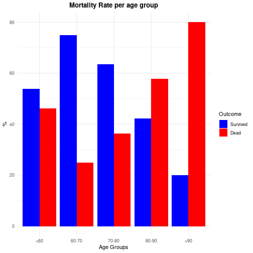

### Hospitalization time per Outcome (Boxplot)


```r
ggplot(data = data,
       mapping = aes(x = Death,
                     y = `Hospitalization_days`,
                     fill = Death))+
  geom_boxplot()+
  scale_fill_manual(
    labels = c("0" = "Survive", "1" = "Died"),
    values = c("0" = "blue", "1" = "red"))+
  labs(
    title = "Death Vs Hospitalization Time Boxplot",
    x = "Outcome",
    y = "Hospitalization Time"
  )+
  theme_minimal()+
  theme(
    plot.title = element_text(hjust = 0.5, face = "bold")
  )
```

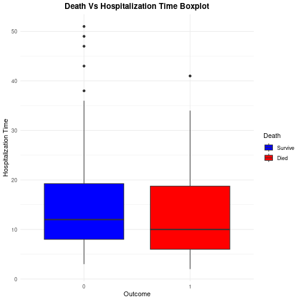

### Hospitalization time per Outcome (Density plot)


```r
ggplot(data = data,
       mapping = aes(x = `Hospitalization_days`,
                     fill = Death))+
  geom_density(alpha = 0.5)+
  scale_fill_manual(
    labels = c("0" = "Survive", "1" = "Died"),
    values = c("0" = "blue", "1" = "red"))+
  labs(
    title = "Death Vs Hospitalization Time Boxplot",
    x = "Hospitalization Time",
    y = "Density"
  )+
  theme_minimal()+
  theme(
    plot.title = element_text(hjust = 0.5, face = "bold")
  )
```

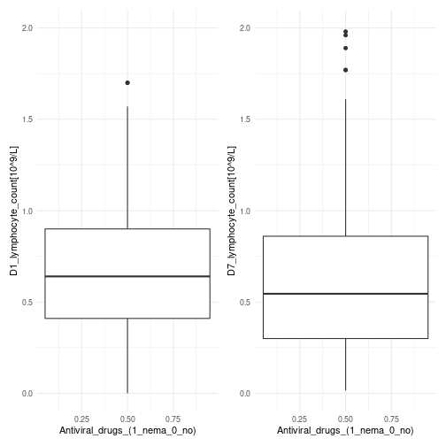


```r
#Plot Charlson index vs age range
ggplot(data = data,
             mapping = aes(x = `Age_range`,
                           y = `Charlson_index[score]`))+
  geom_boxplot(fill = "skyblue", color = "black")+
  labs(
     title = "Charlson Index by Age Range",
      x = "Age Range",
      y = "Charlson Index Score",
  )+
  theme_minimal()
```

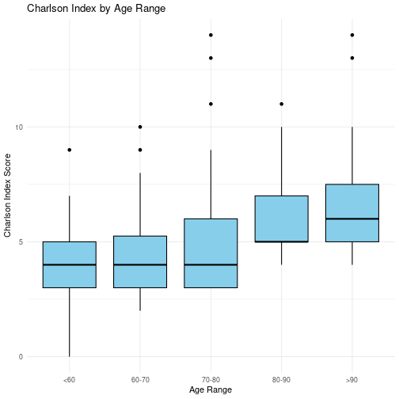


```r
#Plot Hospitalization time vs Age range
ggplot(data = data, 
             mapping = aes(x = `Age_range`,
                           y = `Hospitalization_days`))+
  geom_boxplot(fill = "skyblue", color = "black")+
  labs(
    title = "Hospitalization time vs age group",
    x = "Age group",
    y = "Hospitalization days"
  )+
  theme_minimal()
```

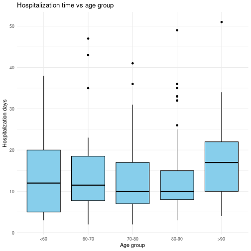


```r
#Plot Hospitalization time vs Affected lung lobes
P1.a <- ggplot(data = data |> 
                 filter(!is.na(`Affected_lung_lobes_1`)),
             mapping = aes(x = `Affected_lung_lobes_1`,
                           y = `Hospitalization_days`))+
  geom_boxplot(fill = "skyblue", color = "black")+
  theme_minimal()+
  labs(
    title = "Affected_lung_lobes_1",
    x = "Affected lung lobes",
    y = "Hospitalization time"
  )
P1.b <- ggplot(data = data |> 
                 filter(!is.na(`Affected_lung_lobes_2`)),
             mapping = aes(x = `Affected_lung_lobes_2`,
                           y = `Hospitalization_days`))+
  geom_boxplot(fill = "red", color = "black")+
  theme_minimal()+
  labs(
    title = "Affected_lung_lobes_2",
    x = "Affected lung lobes",
    y = "Hospitalization time"
  )
P1.a + P1.b + 
  plot_annotation(
    title = "Hospitalization time by affected lung lobes")
```

```
## Warning: Continuous x aesthetic
## ℹ did you forget `aes(group = ...)`?
```

```
## Error in Ops.data.frame(guide_loc, panel_loc): '==' only defined for equally-sized data frames
```

## Onset

### Prepare data


```r
#Group by onset and calculate how many dead and alive people are in each group (also percentage)
Onset <- data |> 
  group_by(onset, Death) |> 
  summarise(Count = n(),
            Avg_Hospitalization_days = round(mean(Hospitalization_days, 
                                                  na.rm = TRUE), 1)) |> 
  ungroup() |> 
  group_by(onset) |> 
  mutate(Percentage = round(Count/sum(Count) * 100, 1)) |> 
  ungroup()
```

```
## `summarise()` has grouped output by 'onset'. You can override using the `.groups` argument.
```

### Outcome per Onset


```r
ggplot(data = Onset,
       mapping = aes(x = onset ,
                     y = Count,
                     fill = Death))+
  geom_bar(stat = "identity", position = "dodge", width = 0.6)+
  scale_fill_manual(labels = c("0" = "Alive",
                               "1" = "Dead"),
                    values = c("0" = "lightblue",
                               "1" = "lightcoral"))+
  labs(title = "Mortality per Onset",
       x = "Onset",
       fill = "Outcome")+
  theme_minimal()+
  theme(plot.title = element_text(hjust = 0.5, face = "bold"),
        legend.title = element_text(face = "bold"))
```

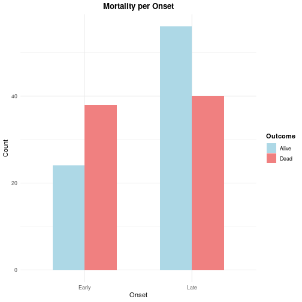

### Outcome Percentage per Onset


```r
ggplot(data = Onset,
       mapping = aes(x = onset ,
                     y = Percentage,
                     fill = Death))+
  geom_bar(stat = "identity", position = "dodge", width = 0.6)+
  scale_fill_manual(labels = c("0" = "Alive",
                               "1" = "Dead"),
                    values = c("0" = "lightblue",
                               "1" = "lightcoral"))+
  labs(title = "Mortality per Onset",
       x = "Onset",
       fill = "Outcome")+
  theme_minimal()+
  theme(plot.title = element_text(hjust = 0.5, face = "bold"),
        legend.title = element_text(face = "bold"))
```

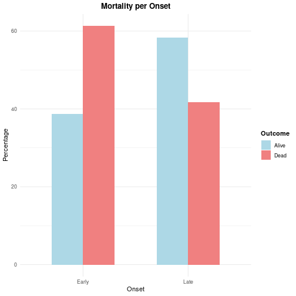

### Onset Vs Hospitalization time (Barplot)


```r
ggplot(data = Onset,
       mapping = aes(x = onset ,
                     y = Avg_Hospitalization_days,
                     fill = onset))+
  geom_bar(stat = "identity", position = "dodge", width = 0.6)+
  scale_fill_manual(labels = c("0" = "Alive",
                               "1" = "Dead"),
                    values = c("0" = "lightblue",
                               "1" = "lightcoral"))+
  labs(title = "Mortality per Onset",
       x = "Onset",
       fill = "Outcome")+
  theme_minimal()+
  theme(plot.title = element_text(hjust = 0.5, face = "bold"),
        legend.title = element_text(face = "bold"))
```

```
## Warning: No shared levels found between `names(values)` of the manual scale and the data's fill values.
## No shared levels found between `names(values)` of the manual scale and the data's fill values.
```

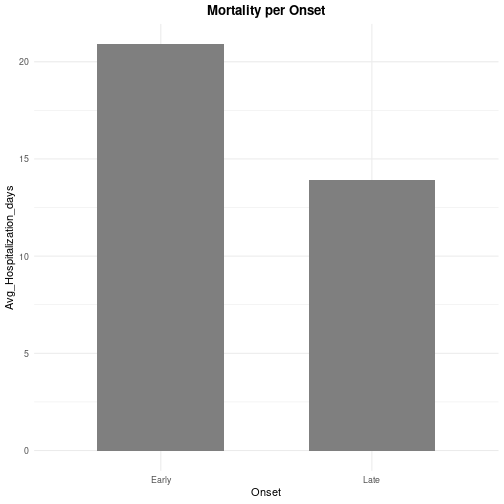

### Onset Vs Charlson Index


```r
ggplot(data = data,
       mapping = aes(x = onset,
                     y = `Charlson_index[score]`,
                     fill = onset))+
  geom_boxplot()+
  scale_fill_manual(
    values = c("Early" = "tomato", "Late" = "skyblue"))+
  labs(
    title = "Onset Vs Charlson Index",
    x = "Onset",
    y = "Charlson Index"
  )+
  theme_minimal()+
  theme(
    plot.title = element_text(hjust = 0.5, face = "bold")
  )
```

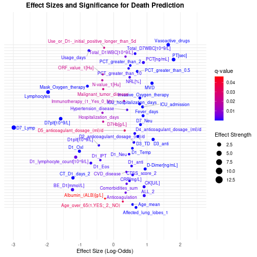

## Sum of Comorbidities Vs Charlson Index scatterplot


```r
ggplot(data, 
       mapping = aes(x = Comorbidities_sum, y = `Charlson_index[score]`))+
  geom_point()+
  geom_smooth(method = "lm")
```

```
## `geom_smooth()` using formula = 'y ~ x'
```

```
## Warning: Removed 10 rows containing non-finite outside the scale range (`stat_smooth()`).
```

```
## Warning: Removed 10 rows containing missing values or values outside the scale range (`geom_point()`).
```

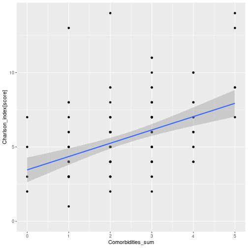

### NLR and outcome boxplot


```r
ggplot(data = data,
       mapping = aes(x = Death,
                     y = `NRL[%]`,
                     fill = Death))+
  geom_boxplot()+
  scale_fill_manual(
    labels = c("0" = "Alive", "1" = "Dead"),
    values = c("0" = "tomato", "1" = "skyblue"))+
  labs(
    title = "NRL Vs Outcome",
    x = "Outcome",
    y = "NRL (%)"
  )+
  theme_minimal()+
  theme(
    plot.title = element_text(hjust = 0.5, face = "bold")
  )
```

```
## Warning: Removed 1 row containing non-finite outside the scale range (`stat_boxplot()`).
```

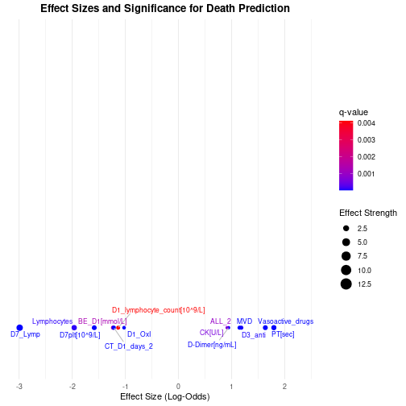
